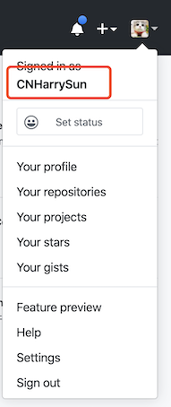

# Flutter SDK 发版准备工作

## 1. GitHub 账号添加到公司组织
#### 需要将开发人员的 GitHub 账号添加到公司的 GitHub 组织中，并且把 Flutter 仓库的权限开放给开发人员

需要的信息：
    
    开发人员的 GitHub 用户名

用户名如何查看：GitHub 首页点击自己的头像查看

Flutter 需要开发权限的仓库：

[IM SDK：https://github.com/rongcloud/rongcloud-im-flutter-sdk](https://github.com/rongcloud/rongcloud-im-flutter-sdk)

[IMKit Flutter Quickstart：https://github.com/rongcloud/imkit-flutter-quickstart](https://github.com/rongcloud/imkit-flutter-quickstart)

[RTC SDK：https://github.com/rongcloud/rongcloud-rtc-flutter-sdk](https://github.com/rongcloud/rongcloud-rtc-flutter-sdk)

### 2. Flutter 发版权限

需要的信息：
    开发人员的 Gmail 账号

pud.dev 处理发布权限

# 2. Flutter SDK 发布

### 1. 更新发版信息并提交到 GitHub
    1. CHANGELOG.md
    2. pubspec.yaml
    3. README.md
### 2. 新建 tag 标签
### 3. cd 到目录仓库 dev 分支
##### 1. 检查网络验证
> *注：这一步以及后面两步需要终端翻墙*
1. 复制终端代理命令
2. 粘贴到终端回车
3. 执行命令检查网络验证：`curl https://www.google.com`

如果终端没有翻墙，执行上面的命令后终端会卡住没有反应；

如果终端翻墙，执行上面的命令后终端会收到成功的回文(一个 html 格式的文本信息)。

##### 2. 检查错误
cd 到工程目录下，执行下面命令：

`flutter packages pub publish --server=https://pub.dartlang.org --dry-run`	

##### 3. 发布代码
cd 到工程目录下，执行下面命令：

`flutter packages pub publish --server=https://pub.dartlang.org` 

### 4. 合并 dev -> master ，推送到 GitHub 上即可
### 5. 发布 RTC Flutter, 重复 1 - 4 检查。
### 6. 检查 pub.dev 中新版本是否发布成功
### 7. 更新仓库 imkit-flutter-quickstart：
将 rongcloud-im-flutter-sdk/example 中除了 pubspec.yaml、pubspec.lock 和 build 文件夹 copy 到 imkit-flutter-quickstart 仓库中，然后发布。
