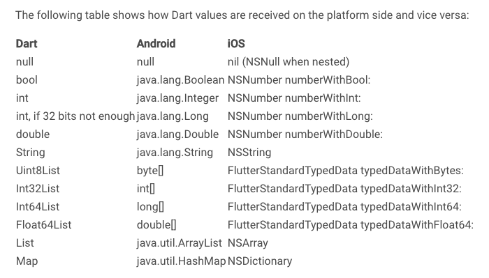
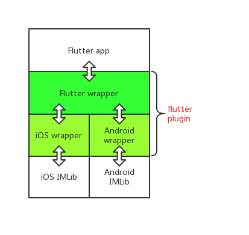

# 融云 IM Flutter Plugin

本文档讲解如何二次开发 IM Flutter Plugin

[Flutter 跨平台原理](https://flutter.dev/docs/development/platform-integration/platform-channels)


跨平台传输的数据类型对比



# 整体架构



其中绿色部分代表了整个 Flutter Plugin，包含 `Flutter wrapper`，`iOS wrapper`，`Android wrapper` 三个部分

双向箭头代表了代码的调用逻辑

# 目录结构

`android/`:Android wrapper

`ios/`：iOS wrapper 

`lib/`：Flutter wrapper

`example/`：demo

`example/android/`：Android project

`example/ios/`：iOS project

`example/lib/`：Flutter app

# 原理

Futter 通过 `MethodChannel` 实现与 native 的交互

`调用任何接口，Flutter 都通过 MethodChannel 把 methodname 和 arguments 传递出去，native 接收然后根据 methodname 知道 Flutter 的操作，然后根据具体的 arguments 处理，反之 native 调用 Flutter 也是如此`


`想要了解如何调用的，可以自行在 native 平台 debug`

## MethodChannel 的创建

`Flutter`

```dart
static final MethodChannel _channel = const MethodChannel('rongcloud_im_plugin');
```

`iOS`

```objective-c
FlutterMethodChannel* channel = [FlutterMethodChannel
      methodChannelWithName:@"rongcloud_im_plugin"
            binaryMessenger:[registrar messenger]];
```

`Android`

``` java
final MethodChannel channel = new MethodChannel(registrar.messenger(), "rongcloud_im_plugin");
```

# Flutter 与 iOS/Android 数据交互方式

```
1.iOS/Android 不给 Flutter 返回数据
2.iOS/Android 通过 FlutterResult 给 Flutter 返回数据
3.iOS/Android 通过 MethodChannel 给 Flutter 返回数据
```

## 1. iOS/Android 不给 Flutter 返回数据


`Flutter`

```dart
static void init(String appkey) {
    _channel.invokeMethod(RCMethodKey.Init, appkey);
    _addNativeMethodCallHandler();
  }
```

`iOS`

```objective-c
- (void)initWithRCIMAppKey:(id)arg {
    NSString *LOG_TAG =  @"init";
    [RCLog i:[NSString stringWithFormat:@"%@ start param:%@",LOG_TAG,arg]];
    if([arg isKindOfClass:[NSString class]]) {
        NSString *appkey = (NSString *)arg;
        [[RCIMClient sharedRCIMClient] initWithAppKey:appkey];
        
        [[RCIMClient sharedRCIMClient] setReceiveMessageDelegate:self object:nil];
        [[RCIMClient sharedRCIMClient] setRCConnectionStatusChangeDelegate:self];
    }else {
        NSLog(@"init 非法参数类型");
    }
}
```

`Android`

```java
private void initRCIM(Object arg) {
        String LOG_TAG = "init";
        RCLog.i(LOG_TAG+" start param:"+arg.toString());
        if(arg instanceof String) {
            String appkey = String.valueOf(arg);
            RongIMClient.init(mContext,appkey);

            setReceiveMessageListener();
            setConnectStatusListener();
        }else {
            Log.e("RCIM Flutter init", "非法参数");
        }
    }
```

## 2. iOS/Android 通过 FlutterResult 给 Flutter 返回数据

能够快速返回的数据可以采用这个方式，比如说连接 IM 的回调


`Flutter`

```dart
static Future<int> connect(String token) async {
    final int code = await _channel.invokeMethod(RCMethodKey.Connect, token);
    return code;
  }
```

`iOS`

```objective-c
- (void)connectWithToken:(id)arg result:(FlutterResult)result {
    NSString *LOG_TAG =  @"connect";
    [RCLog i:[NSString stringWithFormat:@"%@ start param:%@",LOG_TAG,arg]];
    if([arg isKindOfClass:[NSString class]]) {
        NSString *token = (NSString *)arg;
        [[RCIMClient sharedRCIMClient] connectWithToken:token success:^(NSString *userId) {
            [RCLog i:[NSString stringWithFormat:@"%@ success",LOG_TAG]];
            result(@(0));
        } error:^(RCConnectErrorCode status) {
            [RCLog i:[NSString stringWithFormat:@"%@ fail %@",LOG_TAG,@(status)]];
            result(@(status));
        } tokenIncorrect:^{
            [RCLog i:[NSString stringWithFormat:@"%@ fail %@",LOG_TAG,@(RC_CONN_TOKEN_INCORRECT)]];
            result(@(RC_CONN_TOKEN_INCORRECT));
        }];
    }
}
```

`Android`

```java
private void connect(Object arg, final Result result) {
        String LOG_TAG = "connect";
        RCLog.i(LOG_TAG+" start param:"+arg.toString());
        if(arg instanceof String) {
            String token = String.valueOf(arg);
            RongIMClient.connect(token, new RongIMClient.ConnectCallback() {
                @Override
                public void onTokenIncorrect() {
                    mMainHandler.post(new Runnable() {
                        @Override
                        public void run() {
                            RCLog.e("connect "+String.valueOf(31004));
                            result.success(new Integer(31004));
                        }
                    });
                }

                @Override
                public void onSuccess(String s) {
                    mMainHandler.post(new Runnable() {
                        @Override
                        public void run() {
                            RCLog.i("connect success");
                            result.success(new Integer(0));
                        }
                    });
                }

                @Override
                public void onError(RongIMClient.ErrorCode errorCode) {
                    final RongIMClient.ErrorCode code = errorCode;
                    mMainHandler.post(new Runnable() {
                        @Override
                        public void run() {
                            RCLog.e("connect "+String.valueOf(code.getValue()));
                            result.success(new Integer(code.getValue()));
                        }
                    });

                }
            });

            fetchAllMessageMapper();
        }else {

        }
    }
```

iOS/Android 代码中的 result 是怎么来的？

当 Flutter 调用接口触发原生代码的的时候

iOS 会触发下面方法

```objective-c
- (void)handleMethodCall:(FlutterMethodCall*)call result:(FlutterResult)result {
    [[RCIMFlutterWrapper sharedWrapper] handleMethodCall:call result:result];
}
```

Android 会触发下面方法

```java
public void onMethodCall(MethodCall call, Result result) {
    RCIMFlutterWrapper.getInstance().onFlutterMethodCall(call,result);
  }
```

两个平台都一样，会有个 call 的对象和 result 对象

call 对象里面保存了`方法名和参数`，通过方法名确定调用具体的方法;通过参数获取具体的数据 

result 对象将数据返回给 Flutter 


## 3. iOS/Android 通过 MethodChannel 给 Flutter 返回数据

不确定什么时间响应的数据可以采用这个方式，比如说收到消息的回调


`Flutter`

```dart
//Function 相当于 iOS 的 block 回调 ，Android 的 callback 回调
static Function(Message msg, int left) onMessageReceived;

//响应的代码
static void _addNativeMethodCallHandler() {
    _channel.setMethodCallHandler((MethodCall call) {
      switch (call.method) {
        case RCMethodCallBackKey.ReceiveMessage:
          if (onMessageReceived != null) {
            Map map = call.arguments;
            int left = map["left"];
            String messageString = map["message"];
            Message msg = MessageFactory.instance.string2Message(messageString);
            onMessageReceived(msg, left);
          }
          break;
      }
    });
  }

//调用的代码
RongIMClient.onMessageReceived = (Message msg,int left) {
      print("receive message messsageId:"+msg.messageId.toString()+" left:"+left.toString());
    };
```

`iOS`

```objective-c
- (void)onReceived:(RCMessage *)message left:(int)nLeft object:(id)object {
    @autoreleasepool {
        NSMutableDictionary *dic = [NSMutableDictionary new];
        NSString *jsonString = [RCFlutterMessageFactory message2String:message];
        [dic setObject:jsonString forKey:@"message"];
        [dic setObject:@(nLeft) forKey:@"left"];
        
        [self.channel invokeMethod:RCMethodCallBackKeyReceiveMessage arguments:dic];
    }
}
```

`Android`

```java
RongIMClient.setOnReceiveMessageListener(new RongIMClient.OnReceiveMessageListener() {
            @Override
            public boolean onReceived(final Message message,final int i) {

                mMainHandler.post(new Runnable() {
                    @Override
                    public void run() {
                        String messageS = MessageFactory.getInstance().message2String(message);
                        final Map map = new HashMap();
                        map.put("message",messageS);
                        map.put("left",i);
                        mChannel.invokeMethod(RCMethodList.MethodCallBackKeyReceiveMessage,map);
                    }
                });

                return false;
            }
        });
```


# 依赖 native SDK

## iOS wrapper 如何依赖 IMLib

在 `./ios` 目录 iOS wrapper 会自动生成一个 `podspec` 文件

里面内容与标准的 podspec 一致，默认只会依赖 Flutter，只需要加上 `s.dependency 'RongCloudIM/IMLib', '4.0.2'` 即可依赖 IMLib


## Android wrapper 如何依赖 IMLib

Android wrapper 所在目录会自动生成一个 `build.gradle` 文件

里面内容与标准的 build.gradle 一致，需要加上 

```
rootProject.allprojects {
    repositories {
        google()
        jcenter()
        mavenCentral()
        maven {url  "https://dl.bintray.com/rongcloud/maven"}
    }
}

dependencies {
    api 'cn.rongcloud.sdk:im_lib:2.9.19'
    implementation 'com.android.support:appcompat-v7:26.0.0'
}
```

即可依赖 IMLib


# 可能的问题

## Flutter wrapper 接口调用顺序是怎样的？

1：调用 `init`

2：调用 `connect`

3：其余接口按需调用


## Flutter 依赖 native SDK 各个版本是怎样的？

iOS 依赖的是 pod 管理的 IMLib ，在 `./ios` 目录的 `podspec` 文件没有指定版本，默认是最新版本

Android 依赖的 maven 管理的 IMLib，在 `./android` 目录的 `build.gradle` 文件中指明了具体版本


## Flutter & iOS & Android 的核心代码都在哪儿？

`Flutter wrapper`：`rong_im_plugin.dart`

`iOS wrapper`：`RCIMFlutterWrapper.m`

`Android wrapper`：`RCIMFlutterWrapper.java`

## 如何传递复杂的数据类型，如 iOS/Android 的 Message 对象？

根据上面的跨平台传输的数据类型对比图可以知道只能传递复杂的数据类型为 String，List，Map，所以 `复杂的对象需要转成 Map 进行传递`，可以参见 native 收到消息通知 Flutter 的代码，里面涉及了消息的转换
