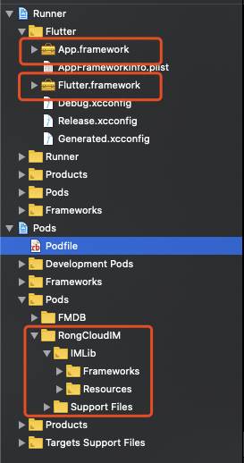
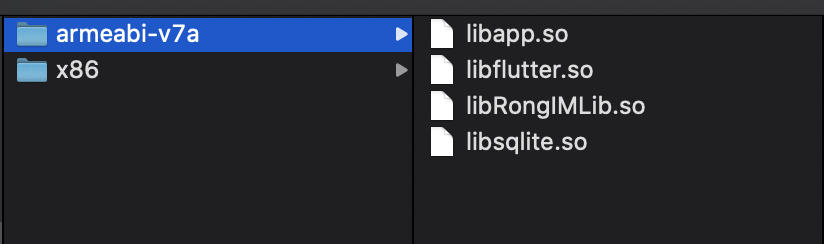

Flutter 需要有哪些文件才可以在不同平台运行：

#### 1. iOS
iOS 需要有 2 个 `framework` 和 `IMLib` 相关的文件才可以运行起来，分别是：`App.framework`、`Flutter.framework` 和 `IMLib 文件夹`。

`App.framework` ：所有的 dart 代码，包括业务代码，三方 package 代码，它们所依赖的 Flutter 框架代码

`Flutter.framework` ：Flutter 架构部分

`IMLib 文件夹` ：融云即时通讯使用

#### 2. Android
Android 运行需要有 4 个 `so` 才可以运行起来，分别是：`libapp.so`、`libflutter.so`、`libRongIMLib.so` 和 `libsqlite.so`。

`libapp.so` ：所有的 dart 代码，包括业务代码，三方 package 代码，它们所依赖的 Flutter 框架代码

`libflutter.so` ：Flutter 架构部分

`libRongIMLib.so` ：融云即时通讯使用

`libsqlite.so` ：融云即时通讯使用

##### 注意事项
Android 端包运行不起来的问题

可以分析打出的 apk 包一般会出现在多个 cpu 架构下，存在某个架构下 so 库丢失导致，以上 4 个 so 缺失任何一个都不能运行。

这边建议只使用一个较低版本的架构进行打包，如："armeabi-v7a"