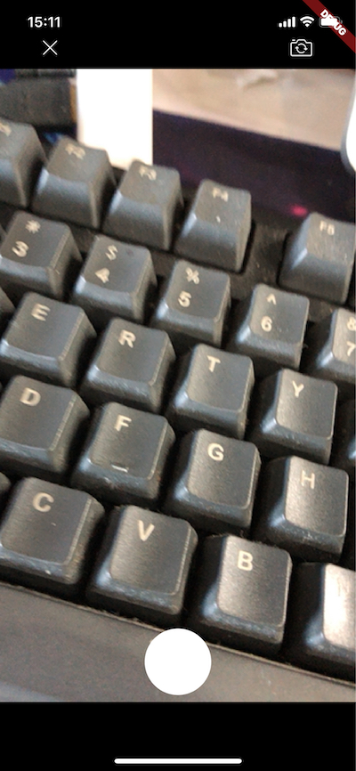
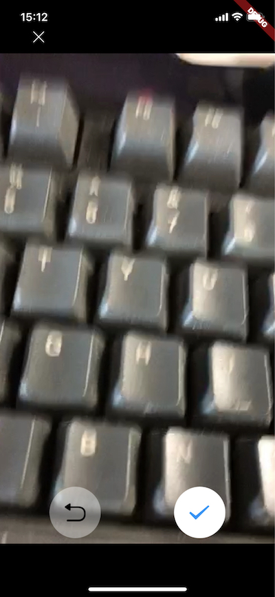
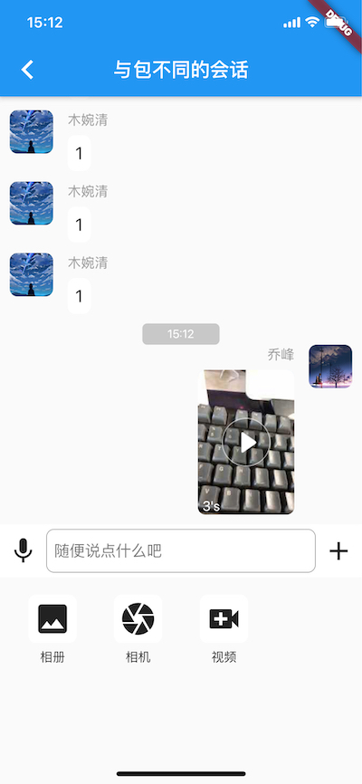

RongCloud Flutter SDK 从 0.9.9 版本开始支持小视频消息

小视频消息为收费业务，需提前在[融云开发者后台](https://developer.rongcloud.cn/signup/?utm_source=IMfluttergithub&utm_term=Imsign)开通才能正常使用该消息，否则会报 `26101`

小视频录制使用了 [camera](https://pub.dev/packages/camera) 库

该库要求 Android 的 minSdkVersion 最低为 21

小视频消息有时长限制，最多 10s

小视频消息构造与发送

```dart
SightMessage sightMessage = SightMessage.obtain(videoPath, recodeTime);
RongIMClient.sendMessage(conversationType, targetId, sightMessage);
```
demo 中实现了小视频的录制，预览，发送，播放等功能

详见 源码 `example/lib/im/pages/sight/` 目录


`小视频预览`



`小视频录制`



`小视频消息展示`


